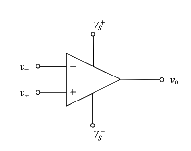
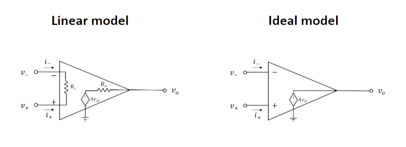
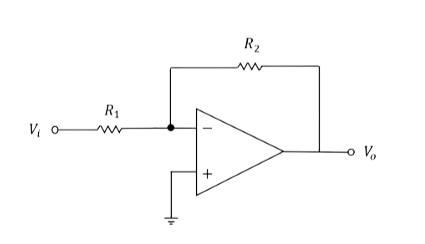
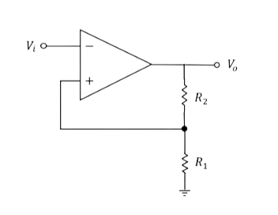

# Operational Amplifier

## Introduction to Operational Amplifier
:::note Definition of Operational Amplifier

Operational Amplifiers are constructed such that they
amplify the voltage difference between
the two input signals.

$$
v_0 = A(v_+-v_-) = Av_d,
$$
where $A$ is the open-loop voltage gain.
:::

### Terminologies and Glossaries:
- The **open-loop gain** of an electronic amplifier is the gain obtained when no overall feedback is used in the circuit.
- **Feedback** occurs when outputs of a system are routed back as inputs as part of a chain of cause-and-effect that forms a circuit or loop.
- The $−$ and $+$ terminals of the amplifiers are called the **inverting** and **non-inverting** terminals, respectively.

### OpAmp Properties
:::tip Ideal Model
In op-amps, the input resistance, $R_i$ , is very large, and the output resistance, $R_o$ , is very small.

In the ideal op-amp model, $R_i = \infty, R_o =0, i_- = i_+  = 0$.

:::

:::tip Output Voltage
The output voltage of an op-amp is limited by the power
supplies used to power up the op-amp chip.
$$
V_{S^-} < V_O < V_{S^+}
$$
:::

### Feedback
In open-loop configuration, op-amp cannot amplify input voltages greater than a few micro volts since the open-loop voltage gain is typically very large. It cannot be used as
a voltage amplifier.

:::note Definition of Negative Feedback
In circuits with negative feedback, as the
output increases, the input will decrease, and vice versa, such
that the output signal would reach the desired stable level.

:::

:::note Definition of Positive Feedback
In circuits with positive feedback, when the
output increases, the input will also increase, and vice versa.
The output of circuits with positive feedback is always at its
limits.

:::

### Feedback properties
:::tip Virtual Short Principle
In op-amp circuits with negative feedback, the inverting terminal and the non-inverting terminal have the similar voltage.

Proof:
$$
V_+ - V_- = \frac{V_o}{A} \approx 0
$$
:::